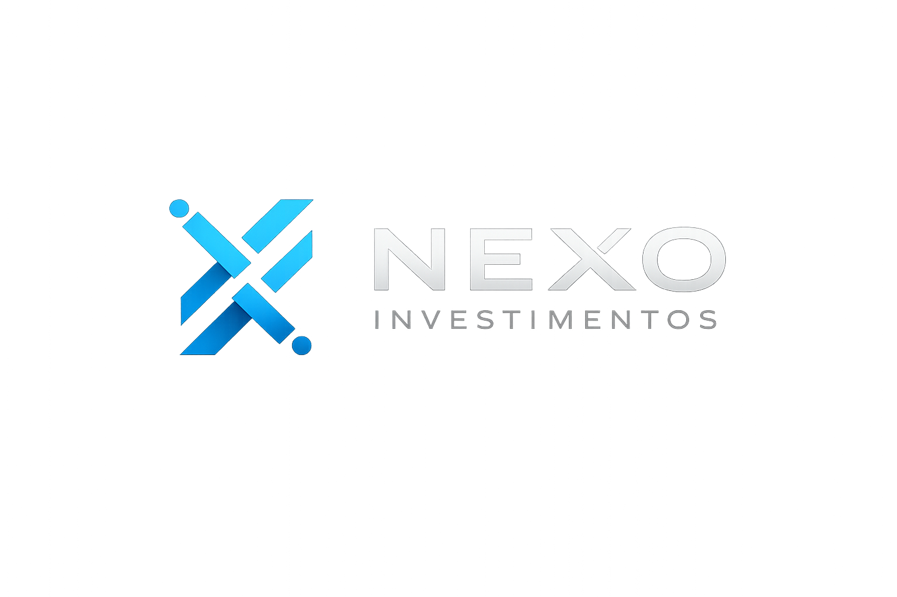
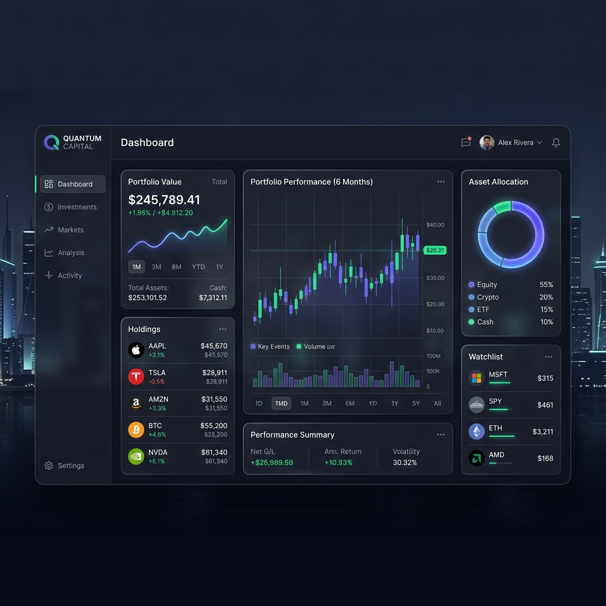

<p align="center">
  
</p>

# NEXO — Gerenciamento de Investimentos & Patrimônio

NEXO é uma plataforma de consolidação patrimonial, análise e inteligência de portfólio desenvolvida para investidores e clientes premium. Sua essência foca tanto em engenharia rigorosa quanto em uma interface (UX/UI) altamente sofisticada calcada nas correntes mais inovadoras de "Glassmorphism" do design de mercado.



## 🚀 Como Iniciar (Ambiente Local)

A estrutura do projeto conta com pequenos atalhos prontos para ligar todo o ecossistema a partir de um único terminal graças ao nosso `Makefile` nativo.

Certifique-se de que tenha Node/NPM e Python instalados na sua máquina, e em seguida:

**1. Instalar as Dependências:**
```bash
make setup
```

**2. Executar em Conjunto (API + Frontend):**
```bash
make dev
```

*Seu frontend estará flutuando em `http://localhost:3000` (incluindo rotas de `/login` e `/register`), e se comunicando fielmente junto a seu backend em `http://localhost:8000` na mesma tab do terminal.*

**Deseja acoplar à sua base de dados local Docker?**
```bash
make dev-docker
```

---

## 🛠 Stack Tecnológica Base

| Área | Tecnologias Utilizadas |
| :--- | :--- |
| **Frontend** | Next.js (App Router), React, TypeScript, CSS Modules |
| **Backend** | Django, Django REST Framework, SimpleJWT |
| **Bancos** | PostgreSQL (Relacional), Redis (Cache/Assíncrono), SQLite (Fallback) |
| **Infraestrutura** | Docker Orchestration, Venv (Python) |

## 🏗 Arquitetura Modular

Optamos por manter o padrão *Monolito Modular* em virtude da velocidade provendo blindagem futura.

```
NEXO/
├── frontend/             # O SPA construído pelo painel do Next.js
│   ├── src/app/          # Padrões de Roteamento de telas
│   ├── public/           # Assets e Logos
│   └── package.json    
├── backend/              # O cerne operacional (O motor Python)
│   ├── apps/
│   │   ├── identity/     # Autenticação e Configurações de acesso 
│   │   └── core/         # Abstrações primárias do modelo
│   ├── nexo_api/         # O Coração de Roteamento Base e Environment
│   └── requirements.txt
├── docker-compose.yml    # Manifesto de Bancos de Dados local
└── Makefile              # Comando central de startup `make dev`
```

---

### Observação Técnica (IA Agents)
> Os arquivos invisíveis da raiz (`.ai-system`, `.ai-context`, entre outros) são os cérebros balizadores para padronizar os desenvolvimentos técnicos das features da plataforma, desenhados utilizando o `plano_plataforma_investimentos.md`. Não os apague para garantir que o comportamento modular seja respeitado perante arquiteturas futuras.
