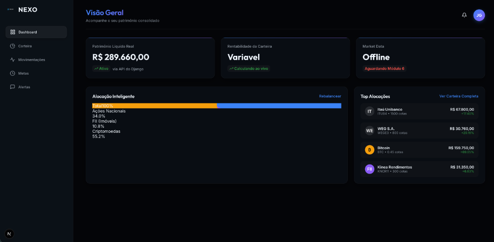
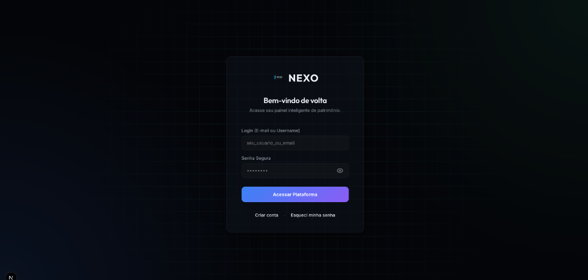

<p align="center">
  
</p>

# NEXO — Terminal de Inteligência Patrimonial

NEXO é um ecossistema **Fullstack (Django + Next.js)** projetado para consolidação patrimonial, análise quantitativa e gestão de portfólios multi-ativos. Criada para investidores de alta renda e plataformas de Wealth Management, a NEXO une o rigor matemático do mercado financeiro a uma interface focada em alta performance e estética **Glassmorphism**.

---

## 🎨 Interface Premium

### Dashboard Analítico

*Visualização dinâmica de alocação por classe de ativos e rentabilidade via Gráfico Donut.*

### Autenticação Inteligente

*Fluxo de Login seguro com JWT e background geométrico interativo com rastreamento de mouse.*

---

## ✨ Funcionalidades Atuais (Release 4)

- **[x] Autenticação Robusta:** Sistema JWT completo com login, registro, MFA e dispositivos confiáveis.
- **[x] Onboarding Completo:** Fluxo guiado com perfil de risco, Suitability e verificação de documentos.
- **[x] Gestão Multi-Ativos:** Suporte para Ações, FIIs, ETFs, RF, Cripto, Fundos e Previdência.
- **[x]Dashboard Dinâmico:** Gráficos de alocação, rentabilidade e evolução patrimonial.
- **[x] Inteligência de Carteira:** Concentração, risco, rebalanceamento e score de saúde.
- **[x] Cálculo de IR:** Cálculo trimestral automático, geração de DARF e lotes fiscais FIFO.
- **[x] Metas Financeiras:** Simulações, projeções e alertas de progresso.
- **[x] Documentos e Compliance:** Notas, Informes, Comprovantes e Avisos Regulatórios.

---

## 🚀 Como Iniciar (Ambiente Local)

A estrutura do projeto conta com pequenos atalhos prontos para ligar todo o ecossistema a partir de um único terminal:

**1. Instalar as Dependências:**
```bash
make setup
```

**2. Executar em Conjunto (API + Frontend):**
```bash
make dev
```

*O frontend rodará em `http://localhost:3000` e a API em `http://localhost:8001` (porta atualizada para evitar conflitos de sistema).*

---

**📖 Documentação Detalhada:** Todas as funcionalidades estão documentadas em [docs/README.md](./docs/README.md)

## 📚 Funcionalidades Implementadas

Todas as funcionalidades implementadas estão documentadas na pasta `docs/`:

| # | Funcionalidade | Arquivo |
|---|----------------|---------|
| 1 | Autenticação (JWT, Login, Registro, MFA) | [docs/autenticacao.md](./docs/autenticacao.md) |
| 2 | Importação de Posições (CSV/Excel) | [docs/importacao-posicoes.md](./docs/importacao-posicoes.md) |
| 3 | Conexão de Corretoras | [docs/corretoras.md](./docs/corretoras.md) |
| 4 | Reconciliação Automática | [docs/reconciliacao.md](./docs/reconciliacao.md) |
| 5 | Cálculo de IR e DARF | [docs/imposto-renda.md](./docs/imposto-renda.md) |
| 6 | Notificações Avançadas | [docs/notificacoes.md](./docs/notificacoes.md) |
| 7 | Eventos Corporativos | [docs/eventos-corporativos.md](./docs/eventos-corporativos.md) |
| 8 | Landing Page Pública | [docs/landing-page.md](./docs/landing-page.md) |
| 9 | Análise de Concentração | [docs/concentracao.md](./docs/concentracao.md) |
| 10 | Benchmark | [docs/benchmark.md](./docs/benchmark.md) |
| 11 | Evolução Patrimonial | [docs/historico-patrimonial.md](./docs/historico-patrimonial.md) |

**[Ver índice completo](./docs/README.md)**

---

## 🛠 Stack Tecnológica

| Camada | Tecnologias |
| :--- | :--- |
| **Frontend** | Next.js (App Router), TypeScript, CSS Modules |
| **Backend** | Django 4.2+, DRF, SimpleJWT, yfinance |
| **Banco de Dados** | PostgreSQL, Redis, SQLite (Dev Fallback) |
| **DevOps** | Docker, Makefile, Shell Scripting |
| **Documentação** | drf-spectacular (OpenAPI 3.0), Swagger UI, ReDoc |

---

## 📖 Documentação da API

A plataforma conta com documentação interativa auto-gerada via **drf-spectacular**, a partir dos serializers e views do Django REST Framework. A documentação segue o padrão **OpenAPI 3.0** e está disponível em três formatos:

| URL | Interface | Descrição |
| :--- | :--- | :--- |
| `/api/docs/` | **Swagger UI** | Interface interativa para testar endpoints diretamente no navegador, com autenticação persistente |
| `/api/redoc/` | **ReDoc** | Documentação estilo leitura, ideal para consulta detalhada dos schemas e parâmetros |
| `/api/schema/` | **OpenAPI YAML** | Schema bruto para importação no Postman, Insomnia ou geração de clients |

### Acesso Rápido (em desenvolvimento)

```
Swagger UI → http://localhost:8001/api/docs/
ReDoc       → http://localhost:8001/api/redoc/
```

> A documentação inclui exemplos de integração em **Python**, **JavaScript**, **cURL** e **C#**, além de tabela completa dos módulos disponíveis e instruções de autenticação JWT.

---

## 🏗 Arquitetura Modular

Estruturada para escala maciça usando o padrão *Modular Monolith*:

```
NEXO/
├── frontend/             # Next.js SPA
│   ├── src/app/onboarding # Wizard de Suitability
│   └── src/app/(auth)     # Telas de Acesso
├── backend/              # Django API Engine
│   ├── apps/
│   │   ├── identity/     # Users & Auth & Profiles
│   │   ├── portfolio/    # Assets & Positions & Calculus
│   │   └── market_data/  # Yahoo Finance Providers
└── start.sh              # Orquestrador de processos
```

---

### 🛡 Observação Técnica (IA Agents)
> Os arquivos de contexto na raiz (`plano_plataforma_investimentos.md` e artefatos `.ai`) guiam a evolução sequencial do produto. Mantenha essa estrutura para continuidade do desenvolvimento assistido.
